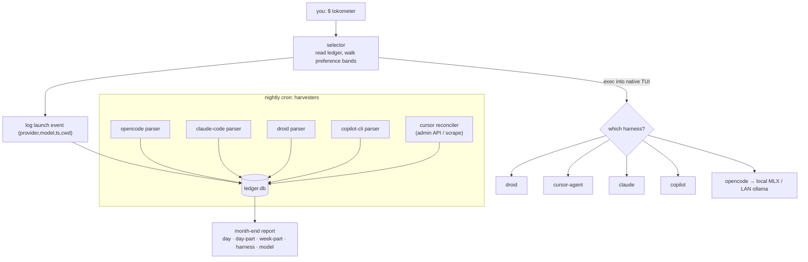

# `tokometer`: Local Usage Harvest + Report (design notes)
### Local-first; works on a locked-down corporate laptop or a personal machine.

> **Scope of this release — tracker only.** The shipped tool is the **harvest + report** half:
> nightly per-harness collectors writing one local SQLite ledger, plus a Markdown/HTML report.
> The **preference-routing launcher** (the `tokometer` command + `cap`/`launch` tables) described
> in §0, §2, and §6 below is *design only* — not part of this release. Those sections are kept as
> the rationale for a possible future add-on; ignore them if you just want tracking.

> **Prime directive:** everything stays on your machine. One local SQLite ledger is the only
> sink. No cloud sync, no third-party telemetry service, no pushing session transcripts anywhere.
> Browser automation (Playwright) is a *last resort* and noted as such.
>
> **What the tracker builds:** nightly harvesters that scrape per-harness token usage to whatever
> granularity each tool allows, into one ledger, plus a report broken down by day / day-part /
> week-part / harness / model / account.
>
> **Design stance:** maximize the best, make do with the least-shitty of the rest. Tracking is
> deliberately *coarse* where it must be.

---

## 0. System shape



Two moving parts you write: the **selector** (tiny) and the **harvesters** (the real work).
The harvesters are *independent* — each can fail without taking the others down, and each
records its own `source` and `confidence` so the report can show you what's exact vs estimated.

---

## 1. The ledger (single local SQLite)

```sql
-- ~/.tokometer/ledger.db   (WAL mode; never leaves this machine)
PRAGMA journal_mode = WAL;

-- one row per harvested usage record, normalized across all tools
CREATE TABLE IF NOT EXISTS usage (
  id            INTEGER PRIMARY KEY AUTOINCREMENT,
  ts            TEXT NOT NULL,            -- ISO-8601 UTC of the activity (not harvest time)
  harness       TEXT NOT NULL,            -- opencode|claude-code|droid|copilot|cursor|local
  provider      TEXT,                     -- factory|cursor|github|anthropic|openai|ollama|mlx
  model         TEXT,
  session_id    TEXT,                     -- tool's session id when available
  request_id    TEXT,                     -- cursor: join key to Admin API
  input_tokens      INTEGER DEFAULT 0,
  output_tokens     INTEGER DEFAULT 0,
  cache_read_tokens INTEGER DEFAULT 0,
  cache_write_tokens INTEGER DEFAULT 0,
  total_tokens  INTEGER GENERATED ALWAYS AS
                (input_tokens+output_tokens+cache_read_tokens+cache_write_tokens) STORED,
  cost_usd      REAL DEFAULT 0.0,
  source        TEXT NOT NULL,            -- session-file|cli-json|admin-api|scrape|self-tally
  confidence    TEXT NOT NULL DEFAULT 'exact', -- exact|estimate
  raw_ref       TEXT,                     -- path/line/url the record came from (for audit)
  account       TEXT,                     -- authenticated login the harness used (e.g. email)
  subscription  TEXT,                     -- plan tier consumed: max|pro|team|enterprise|api|free
  org           TEXT,                     -- friendly account/org grouping label for reports
  UNIQUE(harness, session_id, request_id, ts)  -- idempotent re-harvest
);
CREATE INDEX IF NOT EXISTS idx_usage_ts      ON usage(ts);
CREATE INDEX IF NOT EXISTS idx_usage_harness ON usage(harness);

-- launches the selector made (so we have a tally even when token harvest fails)
CREATE TABLE IF NOT EXISTS launch (
  id        INTEGER PRIMARY KEY AUTOINCREMENT,
  ts        TEXT NOT NULL,
  harness   TEXT NOT NULL,
  model     TEXT,
  cwd       TEXT,                         -- for escalation detection (§6)
  chosen_reason TEXT                      -- which band/threshold picked it
);

-- monthly caps you curate, normalized to a comparable unit per provider
CREATE TABLE IF NOT EXISTS cap (
  provider     TEXT PRIMARY KEY,          -- matches usage.provider
  unit         TEXT NOT NULL,             -- usd|tokens|credits|requests
  monthly_cap  REAL NOT NULL,             -- 0 or NULL = uncapped (local)
  priority     INTEGER NOT NULL,          -- 1 = most preferred
  launch_cmd   TEXT NOT NULL,             -- how the selector starts it (templated)
  reset_dom    INTEGER DEFAULT 1          -- day-of-month the cap resets (UTC)
);
```

Seed `cap` with your curated preference order, e.g.:

| provider | unit | monthly_cap | priority | launch_cmd |
|---|---|---|---|---|
| factory   | tokens | 12_000_000 | 1 | `droid` |
| cursor    | usd    | 20         | 2 | `cursor-agent` |
| anthropic | tokens | 0 (uncapped)| 3 | `claude` |
| github    | credits| 39         | 4 | `copilot` |
| local     | tokens | 0 (uncapped)| 5 | `opencode` |

`anthropic` (Claude Code) is uncapped here because a Max/Pro seat is flat-rate, not metered;
ranked ahead of metered Copilot. Switch it to `unit=usd` with a real cap if you run a metered key.

(Units differ on purpose — the selector compares *% of cap consumed*, never raw numbers.)

---

## 2. The selector (`tokometer`)

Stupid-simple, band-relaxing, preference-ordered. It does **not** route per-request; it picks a
tool at session start and `exec`s into the native TUI so you keep the full experience.

```python
#!/usr/bin/env python3
# ~/.tokometer/tokometer  (chmod +x; put on PATH)   usage: tokometer [extra args passed to the tool]
import os, sqlite3, sys, datetime as dt, subprocess
DB = os.path.expanduser("~/.tokometer/ledger.db")
BANDS = [0.45, 0.85, 1.00]   # prefer <45%, then <85%, then <100%, then uncapped local

def month_start_utc(dom):
    now = dt.datetime.utcnow()
    return now.replace(day=dom, hour=0, minute=0, second=0, microsecond=0).isoformat()

def pct_used(cur, provider, unit, cap, dom):
    if not cap:                       # uncapped (local) -> always 0%
        return 0.0
    col = {"usd":"cost_usd","tokens":"total_tokens",
           "credits":"cost_usd","requests":"id"}.get(unit, "total_tokens")
    agg = "COUNT(*)" if unit == "requests" else f"COALESCE(SUM({col}),0)"
    used = cur.execute(f"SELECT {agg} FROM usage WHERE provider=? AND ts>=?",
                       (provider, month_start_utc(dom))).fetchone()[0]
    return used / cap

def choose(cur):
    rows = cur.execute("SELECT provider,unit,monthly_cap,priority,launch_cmd,reset_dom "
                       "FROM cap ORDER BY priority").fetchall()
    usage = [(p, lc, pct_used(cur, p, u, cap, dom)) for (p,u,cap,_,lc,dom) in rows]
    for band in BANDS:                       # relax the gate until something qualifies
        for provider, cmd, pct in usage:
            if pct < band:
                return provider, cmd, f"{provider} at {pct:.0%} (<{band:.0%})"
    return usage[-1][0], usage[-1][1], "fallback: local"   # last entry is uncapped local

con = sqlite3.connect(DB); cur = con.cursor()
provider, cmd, reason = choose(cur)
cur.execute("INSERT INTO launch(ts,harness,model,cwd,chosen_reason) VALUES(?,?,?,?,?)",
            (dt.datetime.utcnow().isoformat(), provider, None, os.getcwd(), reason))
con.commit(); con.close()
print(f"→ {reason}", file=sys.stderr)
os.execvp(cmd.split()[0], cmd.split() + sys.argv[1:])   # hand the terminal to the native TUI
```

**Pin the model per provider** in `launch_cmd` if the tool supports it at launch (verify on
machine — interactive model-pinning flags differ from the headless `-m`/`--model` ones):
`droid` (config default model or `--model`), `cursor-agent` (`--model`), `copilot` (`--model`),
`opencode` (provider/model in `opencode.jsonc`, pointed at local MLX or LAN Ollama).

---

## 3. Per-harness usage collection — the heart of it

Each subsection: **what to read, what you get, what you don't, the verify-probe, the fallback.**
General rule: prefer the tool's own local session data; fall back to an official API; use
Playwright only if neither exists. Reuse `ccusage`'s parsing *logic* as a reference (it's
local-only) but **vendor it** — don't ship your org transcripts through any external tool, and if you
evaluate `tokscale`, disable its cloud sync/leaderboard first.

### 3.1 OpenCode — easiest, exact

OpenCode persists sessions to SQLite and recomputes cost from token counts.

- **Source:** `opencode.db` — table `sessions(prompt_tokens, completion_tokens, cost)` and
  `messages(model, prompt_tokens, completion_tokens, created_at)`. Path varies by version/channel
  (`~/.local/share/opencode/opencode.db` on 1.2+, or legacy `storage/message/{sid}/*.json`).
- **Verify-probe:** OpenCode has a CLI to print the DB path and a usage/stats view —
  run `opencode --help` and look for the db-path command and a usage/stats subcommand with
  `--json`. Prefer the `--json` stats command if present; else read the DB directly.
- **Granularity:** per-message, exact. `cost` may be stored as 0 — recompute from tokens via a
  local price table (same approach ccusage uses), don't trust the stored cost.
- **Fallback:** none needed.

```sql
-- harvest query (adapt table/columns to the version you find)
SELECT m.created_at, m.model, m.prompt_tokens, m.completion_tokens, s.id
FROM messages m JOIN sessions s ON s.id = m.session_id
WHERE m.created_at > :last_harvest_epoch;
```

### 3.2 Claude Code — exact, including cache tokens (bonus)

- **Implemented:** `collectors/claude_code.py` (harness `claude-code`, provider `anthropic`).
- **Source (transcripts):** `~/.claude/projects/<encoded-cwd>/<session-id>.jsonl` — each
  `type=="assistant"` line carries `message.usage` with `input_tokens`, `output_tokens`,
  `cache_read_input_tokens`, `cache_creation_input_tokens`, plus top-level `uuid`, `requestId`,
  `sessionId`, `cwd`, `timestamp`. One ledger row per assistant message, dedup keyed on the
  message `uuid`; files are skipped on unchanged mtime (high-water in `state/claude-code.json`).
  Thinking tokens are folded into `output_tokens` (so `reasoning_tokens=0`); `<synthetic>` lines
  carry no usage and are dropped by the zero-token guard. Honors `CLAUDE_CONFIG_DIR` and
  `CLAUDE_PROJECTS_GLOB`.
- **Subscription / account (the "which login paid" dimension):** this machine runs several
  accounts via a HOME-swapping *profile* scheme (`~/.claude` plus `~/.claude-profiles/<name>/.claude`,
  e.g. `al`=Employer Team, `bs`=Client, `ss`=personal MAX). Crucially the transcript store is
  **shared** — each profile's `projects/` symlinks to `~/.claude/projects`, so a transcript line
  records the repo (`cwd`) but not the account. Attribution instead comes from each profile's own
  (un-symlinked) `history.jsonl`, which lists the `sessionId`s prompted under that profile. The
  collector unions every profile's history into a `sessionId → (account, subscription, org)` index
  and stamps each message by its `sessionId`. Identity per profile: `subscriptionType`
  (`max|team|…`, or `api`) from `<root>/.credentials.json`; `emailAddress` + `organizationName`
  from `oauthAccount` in the home `.claude.json`. Stored in `usage.account` (login email),
  `usage.subscription` (tier), `usage.org` (friendly label: Personal / Employer / Client).
  Sessions with no history entry are left **unattributed** (`org` NULL). Each run also reconciles:
  rows whose session became attributable after first harvest are back-filled. Measured coverage on
  this machine: ~98% of tokens attributed. Override discovery with `CLAUDE_CONFIG_ROOTS` /
  `CLAUDE_PROFILES_GLOB`.
- **Cost:** left `$0` — a Max/Pro seat is flat-rate, not metered per token (like droid credits /
  local). Set from a price table if you run a metered API key.
- **Optional (telemetry):** native OTel (`CLAUDE_CODE_ENABLE_TELEMETRY=1`, OTLP exporter to a
  local collector) emits `claude_code.token.usage` by type/model — an alternate feed, not used.
- **Granularity:** per-message, exact. **Use this as your calibration anchor** for the noisier
  harnesses, since it's the most trustworthy local source.

### 3.3 Droid (Factory) — tokens in the session transcript

- **Source:** Droid writes a session transcript (`transcript_path` → `session.jsonl`) under its
  data dir (`~/.factory/`, verify). Per-turn token usage is recoverable from the transcript; the
  interactive `/cost`, `/context`, and `/wrapped` commands read the same data.
- **Verify-probe:** locate the sessions dir — `find ~/.factory -name '*.jsonl' -mtime -1` — and
  inspect one transcript for a usage/token field per assistant turn.
- **Granularity:** per-session/turn. Treat as **exact if the transcript has token fields**,
  else `estimate` (tokenize prompt+result locally as a floor).
- **Fallback:** the Factory web dashboard (Playwright, §3.6) for the authoritative monthly number.

### 3.4 GitHub Copilot CLI — local session metrics (CLI only)

The **CLI** records per-session token metrics locally; the VS Code Copilot does not.

- **Source:** Copilot CLI session logs include a `session.shutdown` `modelMetrics` block with
  input / output / cache-read / cache-write (this is what community parsers read). Control the
  location with `--log-dir`; otherwise find the default log dir via probe.
- **Verify-probe:** run `copilot -p "ping" -s --log-dir ~/.tokometer/copilot-logs` once, then inspect
  the produced log for `modelMetrics` / `session.shutdown`.
- **Granularity:** per-session, exact-ish (CLI sessions only — anything you do in the IDE is
  invisible here and must come from the admin path).
- **Fallback / truth:** **org/enterprise metrics API** (admin) — per-user CLI reports now include
  token totals and avg-tokens-per-request. On an **SSO-managed seat your *user-level* billing
  endpoints return nothing** (managed licenses are excluded), so the authoritative monthly number
  is admin-issued (have your org cron you a daily/weekly NDJSON slice filtered to your login) or scraped
  (§3.6).

### 3.5 Cursor — the holdout (no local tokens)

Cursor's headless result object is `{type,subtype,is_error,duration_ms,duration_api_ms,result,
session_id,request_id}` — **deliberately no token counts**. So:

- **Live (cheap):** self-tally each launch (you know you started Cursor) and, if you script any
  `cursor-agent -p` runs, capture the `request_id` + durations as a join key.
- **Truth (token-exact):** **Cursor Admin API** `POST https://api.cursor.com/teams/spend` returns
  per-call `model`, `tokenUsage{input,output,cacheWrite,cacheRead}`, `totalCents`, `userEmail`,
  `timestamp` — filter to your email, join on time/`request_id`. Needs a **team admin key**; if you
  don't hold one, ask your org for a daily email-filtered export, or scrape (§3.6).
- **Granularity:** request-level *if* admin API; else request-count + duration only.
- **Confidence:** mark Cursor rows `estimate` until reconciled against the Admin API.

### 3.6 Playwright fallback (last resort) — for the dashboard-only numbers

For Cursor (no admin key), Copilot (managed seat), and Droid (authoritative monthly), the only
self-service truth may be the vendor's web dashboard. A nightly headless scrape:

- Use `launchPersistentContext` against a **dedicated browser profile you log in once**, so you
  reuse the existing SSO/MFA session instead of automating your org login (don't automate the IdP).
- Navigate to the usage page, read the single "used this month" figure, write one
  `source='scrape', confidence='estimate'` row that *overrides* the running estimate for that
  provider's month-to-date.
- Targets to confirm: Cursor dashboard usage page; `github.com` billing/usage (or the enterprise
  premium-request analytics if you have access); Factory app usage page.

> **your org caution:** headless browser automation that reuses corporate-SSO cookies on a managed
> laptop can trip endpoint security and may bump acceptable-use lines. Treat Playwright as the
> path of last resort, run it visibly the first few times, and prefer an admin-issued export.

### 3.7 Local (MLX / Ollama)

Free, so "budget" is uncapped — you only harvest for the report's completeness. Since OpenCode is
the client hitting local models, **its** `opencode.db` already has these tokens (§3.1). Nothing
extra to do unless you call the local servers outside OpenCode.

### Collection summary

| Harness | Best local source | Tokens? | Granularity | Authoritative fallback |
|---|---|:--:|---|---|
| OpenCode | `opencode.db` / usage CLI | ✅ exact | per-message | — |
| Claude Code | session JSONL / OTel | ✅ exact (+cache) | per-message | `claude -p` json cost |
| Droid | session `*.jsonl` | ✅ if token field | per-session | Factory dashboard (scrape) |
| Copilot CLI | session log `modelMetrics` | ✅ in/out/cache | per-session (CLI only) | org metrics API (admin) |
| Cursor | none (request_id only) | ❌ local | request-count | Admin API (admin) / scrape |
| Local | via OpenCode | ✅ | per-message | — |

---

## 4. Nightly harvest (cron / launchd)

One orchestrator runs each harvester, each idempotent (the `UNIQUE` constraint dedupes on
re-run), each writing its own `source`/`confidence`. Failures are isolated and logged. In this
repo `install.sh` schedules `daily.sh` via **launchd** at 04:00 on macOS (TCC blocks cron);
`daily.sh` harvests, runs the monthly rollover, regenerates the HTML report, and `open`s it.

Per-machine settings live in `~/.tokometer/tokometer.env` (sourced by `daily.sh`, created by `install.sh`,
never committed): `TOKOMETER_GIT_ROOT` (repos are discovered **recursively**, so nested
`<root>/<group>/<repo>` layouts are covered), `TOKOMETER_GIT_AUTHOR` (comma-separated identities, or
`*` for all), and the optional Claude Code `CLAUDE_PROFILES_GLOB` / `CLAUDE_CONFIG_ROOTS`. The git
collector labels each repo with the same `repo_of()` rule the report uses, so commit metrics join
the usage side in the Sankey (driving the code/docs/tests split). See `tokometer.env.example`.

```bash
# crontab -e   (runs 02:17 local; stagger so a hung scrape doesn't block parsers)
17 2 * * *  ~/.tokometer/harvest.sh >> ~/.tokometer/harvest.log 2>&1
```

```bash
#!/usr/bin/env bash
# ~/.tokometer/harvest.sh — run each collector; never let one failure abort the rest
set +e
for h in opencode claude_code droid copilot; do
  python3 ~/.tokometer/collectors/${h}.py && echo "[$(date)] $h ok" || echo "[$(date)] $h FAILED"
done
# cursor + any scrapes last (slowest / most fragile)
python3 ~/.tokometer/collectors/cursor_reconcile.py || echo "[$(date)] cursor FAILED"
```

Each collector keeps a per-harness high-water mark (last `ts`/epoch/line) in a tiny state file so
it only reads new data. Store the mark next to the ledger, not in it.

---

## 5. Month-end report

All breakdowns are GROUP BYs over `usage`. Day-part = time-of-day bucket; week-part = both
day-of-week and weekday/weekend (pick what you like). Render to a single markdown/HTML file.

```sql
-- day-part buckets (local time): night 0-5, morning 6-11, afternoon 12-17, evening 18-23
WITH e AS (
  SELECT *,
    CAST(strftime('%H', ts, 'localtime') AS INT) AS hr,
    strftime('%Y-%m-%d', ts, 'localtime')        AS day,
    strftime('%w', ts, 'localtime')              AS dow      -- 0=Sun..6=Sat
  FROM usage WHERE ts >= :month_start
)
SELECT
  day,
  CASE WHEN hr<6 THEN 'night' WHEN hr<12 THEN 'morning'
       WHEN hr<18 THEN 'afternoon' ELSE 'evening' END        AS day_part,
  CASE WHEN dow IN ('0','6') THEN 'weekend' ELSE 'weekday' END AS week_part,
  harness, model,
  SUM(input_tokens)  AS in_tok,
  SUM(output_tokens) AS out_tok,
  SUM(cache_read_tokens) AS cache_tok,
  SUM(total_tokens)  AS tot_tok,
  SUM(cost_usd)      AS cost,
  COUNT(*)           AS records
FROM e
GROUP BY day, day_part, week_part, harness, model
ORDER BY day, harness;
```

Report sections to render:
1. **Headline:** total tokens + cost for the month, and **% of each cap consumed** (did the
   routing actually spread the load, or did one cap dominate?).
2. **By harness × model** — where the work actually went.
3. **By day** (a sparkline/bar of total tokens) and **by day-part** (when you work) and
   **week-part** (weekday vs weekend).
4. **Confidence footer:** how much of the month is `exact` vs `estimate` — be honest about the
   coarse parts so you don't over-trust the Cursor/Copilot figures.

A ~60-line Python renderer (sqlite3 → jinja/markdown, optional matplotlib PNG for the daily bars)
finishes it. Cron it for the 1st of each month over the *prior* month, just before caps reset.

---

## 6. Stretch: "tom-foolery tax" — re-prompts & forced ineffectiveness

The cleanest first cut needs **no prompt text** (so no your org-privacy exposure) — it reads the
`launch` table alone:

- **Escalation events:** a launch into a lower-priority provider in some `cwd`, followed within
  N minutes by a launch into a *higher*-priority provider in the **same `cwd`** = "the cheaper
  tool didn't cut it, I bounced up." Count these per month — that's the friction the routing
  imposed.
- **Thrash:** ≥3 launches in the same `cwd` within a short window across ≠ providers = churn.
- **Premium-starvation:** escalations that *failed* to find headroom (fell to local) late in the
  month = the cap squeeze biting.

```sql
SELECT a.ts, a.harness AS from_h, b.harness AS to_h, a.cwd
FROM launch a JOIN launch b
  ON a.cwd=b.cwd AND b.ts>a.ts AND b.ts < datetime(a.ts,'+20 minutes')
WHERE (SELECT priority FROM cap WHERE provider=b.harness)
    < (SELECT priority FROM cap WHERE provider=a.harness);  -- moved UP in preference
```

Optional, **gated** richer signal (needs local, scrubbed prompt capture — keep off for
sensitive/client repo paths): near-duplicate prompts across harnesses within a window (minhash) = literal
re-prompts. Defer this until the metadata-only version proves useful.

---

## 7. Trueing-up & drift control

- Each harvester writes `confidence`. The selector's budget math can weight `estimate` rows with a
  safety margin (e.g., treat them as 1.15×) so you under-spend rather than over-spend a cap.
- Whenever an authoritative number arrives (admin export, scrape, Admin API), insert it as a
  `source='admin-api'|'scrape'` row that **supersedes** the month-to-date estimate for that
  provider (delete prior estimate rows for the overlapping window, or carry a correction row).
- Keep band thresholds conservative (45 / 85 / 100) precisely because the Cursor/Copilot inputs
  are coarse. Tighten only once you've watched a full month and seen the drift.

---

## 8. Build order (what to prompt first)

1. `ledger.db` + seed `cap` with your curated order.
2. The **selector** — get `tokometer` launching the right native TUI and logging to `launch`.
3. The **easy harvesters** (OpenCode, Claude Code) — these give you a trustworthy spine.
4. **Droid + Copilot CLI** parsers (verify the session-file shapes first).
5. **Cursor reconciler** (admin API if you have a key; else stub it to self-tally + a TODO).
6. **Report** renderer.
7. *(later)* Playwright scrapes, escalation analytics, prompt-level signals.

Hand this whole file to the on-machine agent and build top-down — each numbered step is
independently testable, and steps 1–3 already give you a working router on day one.
