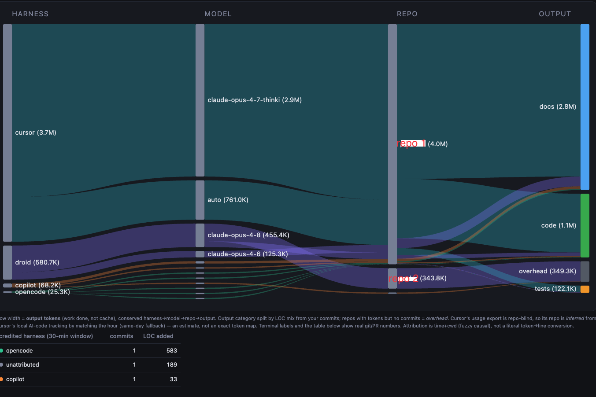
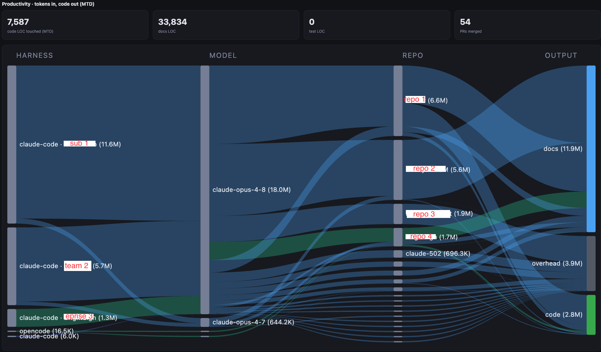
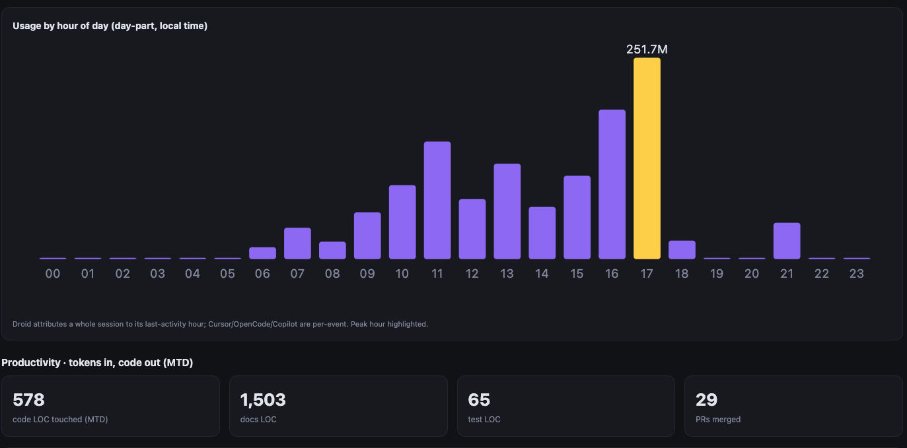
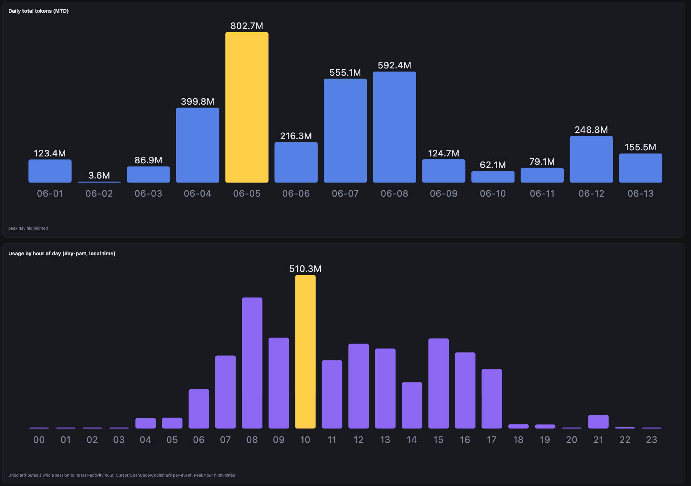

<h1 align="center">tokometer</h1>

<p align="center"><b>A local-first odometer for your AI coding spend.</b><br>
Track every token your coding agents burn — by harness, model, <b>account/subscription</b>, and repo —
into one SQLite ledger on your machine, with a morning report that turns it into something you can act on.</p>

<p align="center"><i>No cloud. No telemetry service. No account to sign up for. Some assembly required.</i></p>

<p align="center"></p>

---

## Why

You're juggling more AI coding tools than you can keep straight, each metered its own opaque way:

- **The enterprise drone.** Copilot *and* a Cursor seat *and* a Claude subscription, with no single
  place to see what you've burned this week before you hit a wall.
- **The independent contractor.** The same harness run under **different accounts for different clients** —
  personal MAX here, a client's Team seat there — that you must keep cleanly separated for billing and IP.

tokometer reads what each tool already writes to disk, normalizes it into one ledger, and shows you the
picture. Here's what that looks like.

---

## Track all your token usage — across harnesses *and* accounts

One normalized ledger across OpenCode, Claude Code, Droid, Copilot, and Cursor. The headline splits
Claude Code **per account** (`claude-code · Personal`, `· Employer`, `· Client`) so subscription-by-subscription
usage is never blended, and a **Claude limits** panel shows your rolling 5-hour / daily / weekly (and
weekly-Opus) usage per account so you know where you stand. Exact vs. estimate is labeled throughout.

## Check that you're using the right account on the right repo



Usage flows **account → repo**, and a companion repo×account matrix flags any repository touched under more
than one account — your IP-isolation gut check. If a client's code lit up under your personal seat, you'll see it.

## Track usage all the way to code outcome

The Sankey at the top conserves **output tokens** from harness → model → repo → **code / docs / tests**,
joined to your actual git commits — so you see not just *what you spent* but *what it produced*:



## See your hotspots — days of the month, hours of the day



When does the work actually happen? Peak days and peak hours, at a glance.

---

## Supported harnesses

| Harness | Provider | How it's harvested | Granularity |
|---|---|---|---|
| **Claude Code** | anthropic | session transcripts + per-account attribution | exact, per-message |
| **OpenCode** | local/any | `opencode.db` message rows | exact, per-message |
| **Droid** (Factory) | factory | session sidecars | exact, per-session |
| **GitHub Copilot CLI** | github | session event logs | estimate (output-only) |
| **Cursor** | cursor | dashboard scrape via Playwright *(optional)* | estimate |
| git / GitHub | — | commit LOC + merged PRs (feeds the Sankey) | exact |

Don't use one? Turn it off in config — it vanishes from the report, no errors, no noise.

## Requirements

- macOS, Linux, or **Windows** (via Git Bash — see [docs/WINDOWS.md](docs/WINDOWS.md)),
  `python3` (3.9+, **stdlib only**) and `sqlite3`
- `git` (code metrics), optionally `gh` (merged-PR metrics)
- *Optional:* `playwright` — only for the Cursor dashboard scrape
- Scheduling: macOS uses **launchd** (installed automatically); on Linux, add the cron line `install.sh` prints; on Windows, register a Task Scheduler job ([docs/WINDOWS.md §5](docs/WINDOWS.md#5-schedule-the-daily-run-with-task-scheduler))

## Quick start

```sh
git clone https://github.com/scottrfrancis/tokometer && cd tokometer
./install.sh                          # installs to ~/.tokometer, schedules a 04:00 daily harvest+report
# don't use Cursor? skip its optional Playwright dependency:
TOKOMETER_SKIP_PLAYWRIGHT=1 ./install.sh

$EDITOR ~/.tokometer/tokometer.env    # pick harnesses + your git root/author
~/.tokometer/harvest.sh               # first harvest
python3 ~/.tokometer/report_html.py   # build the HTML report (prints its path)
```

The scheduled `daily.sh` harvests, rolls over the month, regenerates the HTML report, and opens it.

> **On Windows?** The same scripts run under Git Bash with a few one-time adaptations
> (install `python3` + `sqlite3`, shadow the Store `python3` alias, force UTF-8, and schedule
> via Task Scheduler instead of launchd/cron). The full walkthrough is in
> **[docs/WINDOWS.md](docs/WINDOWS.md)**.

## Configuration — `~/.tokometer/tokometer.env`

`install.sh` writes this with auto-detected values; it's sourced by every run and is **gitignored**
(holds your email + paths).

```sh
# Which harnesses to harvest + show. Drop the ones you don't use: they leave the report
# entirely (table, charts, advisories all follow this list).
# Available: opencode droid copilot claude_code git_metrics gh_metrics cursor
export TOKOMETER_HARNESSES="opencode claude_code git_metrics gh_metrics"

# Repos live here, scanned recursively (so nested <root>/<group>/<repo> layouts are covered).
export TOKOMETER_GIT_ROOT="$HOME/workspace"
export TOKOMETER_GIT_AUTHOR="you@example.com"   # your commit identities, comma-separated, or '*'
export TOKOMETER_GIT_DEPTH="4"
```

## Multi-account Claude Code

Claude Code keeps all transcripts in one shared place regardless of which account is active, so tokometer
figures out *who* ran each session from each profile's own `history.jsonl`. If you switch accounts with a
profile scheme (separate `HOME`s), point the discovery glob at them:

```sh
export CLAUDE_PROFILES_GLOB="$HOME/.claude-profiles/*/.claude"
```

### Claude limits (rolling windows)

The report shows your Claude usage per **5-hour / daily / weekly / weekly-Opus** window, per account.
Anthropic doesn't publish fixed token thresholds and Claude Code stores no live limit counter, so this is a
**burn-rate gauge**, not a literal "% of limit." Set your own observed caps to render a % bar:

```sh
export TOKOMETER_CLAUDE_LIMIT_5H="..."   # also _24H, _7D, _OPUS7D
```

## Privacy

Everything is local. Each collector reads what a tool already writes on disk and normalizes it into
`~/.tokometer/ledger.db`; the ledger never leaves your machine. Full design notes and per-harness collection
details are in **[DESIGN.md](DESIGN.md)**.

## Caveats

- Local counts are as good as what each tool writes: Copilot is output-only and Cursor is dashboard-scraped
  (both estimates); everything else is exact. The report labels which is which.
- Tested on macOS; Linux works for harvest/report (you supply the cron entry).

## License

[MIT](LICENSE) © 2026 Scott Francis
